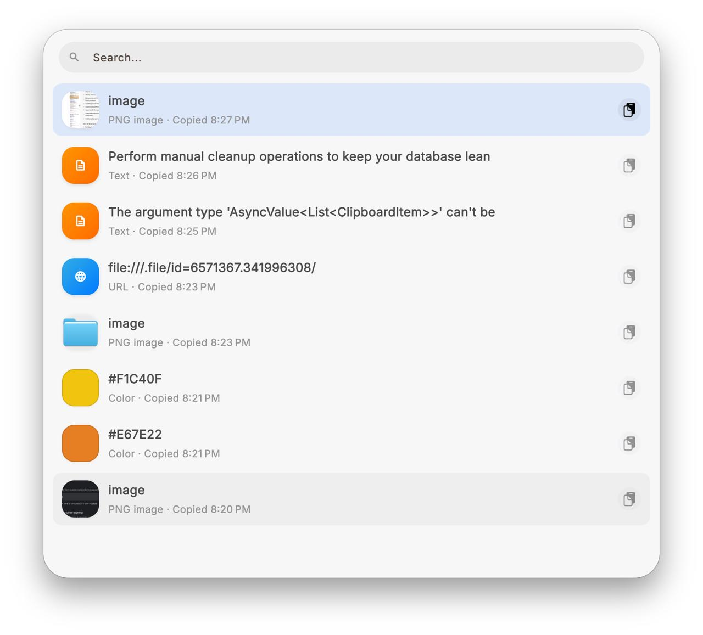

# Clipio 🚀

**Clipio** is a modern, lightweight, and efficient clipboard manager designed specifically for macOS. It focuses on a seamless user experience, privacy, and deep native integration to help you stay productive.

[**Visit the Website**](https://sonhoai27.github.io/clipio/)

## ✨ Key Features

*   **Liquid Glass Quick Paste**: A stunning, semi-transparent overlay UI with native macOS blur effects (`.popover` material) for a premium look and feel.
*   **Real-time Updates**: The list refreshes instantly as you copy new items—no need to close and reopen the window.
*   **Smart Categorization**: Automatically detects and organizes **Links**, **Images**, **Colors** (Hex codes), and **Plain Text**.
*   **Numerical Hotkeys**: Quickly select and paste items using keyboard digits (1-9 and 0) for a blazing-fast workflow.
*   **Unlimited History**: No arbitrary limits. Keep your history as long as you want, or use the "Clear All" maintenance tool for a fresh start.
*   **Privacy First**: All data is stored locally on your device in a secure SQLite database. No cloud, no tracking, no data leaks.

---

## ⌨️ Keyboard Shortcuts

### Navigation
| Key | Action |
| :--- | :--- |
| `↑` / `↓` | Move selection cursor up / down |
| `Enter` | Paste the selected item into the active app |
| `Esc` | Close the Quick Paste window |

### Multi-Select
Enter multi-select mode by **long-pressing** an item or pressing **`Space`**.

| Key | Action |
| :--- | :--- |
| `Space` | Toggle selection of the item at the cursor |
| `Shift + ↓` | Select range downward (top-to-bottom) |
| `Shift + ↑` | Select range upward (bottom-to-top) |
| `⌘ + A` | Select all items in the current list |
| `Enter` | **Merge and paste** all selected items (joined by newlines) |
| `Esc` | Exit multi-select mode |

> [!TIP]
> **Excel-Style Selection**: `Shift + Arrow` keys use an anchor-based system. Moving in the opposite direction will shrink the selection back towards the anchor before extending it the other way.

---

*"Clipio - Simplify your workspace, amplify your productivity."* 🧡
